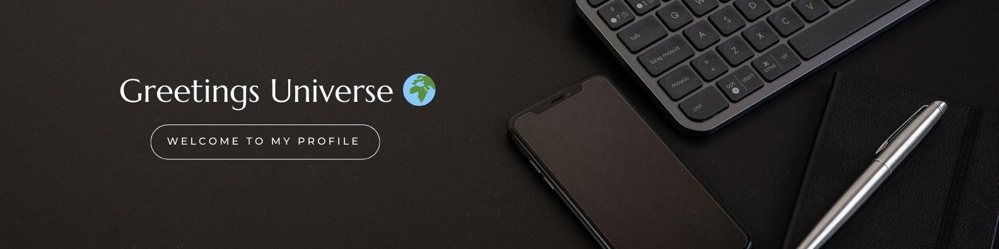

<!--Banner-->

<!--Night Owl image-->

  

<!--Header Name-->
#  👋Hi ɪ'ᴍ Francis! 
**Data Scientist | Business Strategist | Data Analyst | Business Intelligence**
  

------
<!--Start Intro-->               

Hi, welcome to my portfolio where I share my journey, projects, and passion for solving real-world problems with data! 🌟. 

✨ I’m a Data Scientist with a strong foundation in business analytics, machine learning, business intelligence, and AI-driven automation, specializing in building intelligent systems that uncover insights, enhance efficiency, and support data-driven strategies. My work combines technical precision with strategic thinking to deliver solutions that create measurable impact.

I have applied my skills to projects involving predictive modeling, automated workflows, business intelligence dashboards, and conversational AI tools, delivering solutions that improve decision-making, streamline processes, and boost productivity.

I am strategic, detail-oriented, innovative, and highly collaborative, qualities that enable me to translate complex data into clear insights and build solutions that are not only technically sound but also aligned with organizational goals.
<!--End Intro-->
----
<!--Languages and Tools Section-->       
<h2 align="center">Tᴇᴄʜ sᴛᴀᴄᴋ</h2> 
<picture>
  <source media="(prefers-color-scheme: dark)" srcset="./Skills_Animation_Dark.gif">
  <source media="(prefers-color-scheme: light)" srcset="./Skills_Animation_White.gif">
  
</picture>
 

<h3 align="left">📚 Current Learning</h3>
<ul align="left">
  <li>🤖 Pushing deeper into Machine Learning & AI.</li>
  <li>☁️ Leveling up in cloud computing (AWS & Azure).</li>
</ul>

 **⚡Core Competencies**

📌 Machine Learning & AI: Build predictive models and intelligent systems with Python and ML libraries.

📌 Data Analysis: Extract insights and identify trends from complex datasets.

📌 Data Visualization & BI: Design dashboards and visualizations with Power BI, Tableau, and Excel.

📌 SQL & Database Management: Query and manage data in SQL Server, MySQL, and PostgreSQL.

----

<!--Contact Section--> 

<h2 align="center">🤝 Cᴏɴɴᴇᴄᴛ Wɪᴛʜ Mᴇ 🤝 </h2>

  

 

  

###

<!--Footer--> 

  

**💼Portfolio👇**
 
*Disclaimer⚠️*: The datasets, analyses, and reports included in this portfolio are entirely synthetic and created solely for illustrative purposes. They do not contain any real proprietary, confidential, or sensitive information from any organization or individual. These examples are intended to demonstrate my technical competencies in data science, machine learning, and data analysis while strictly adhering to ethical standards and respecting data privacy.

